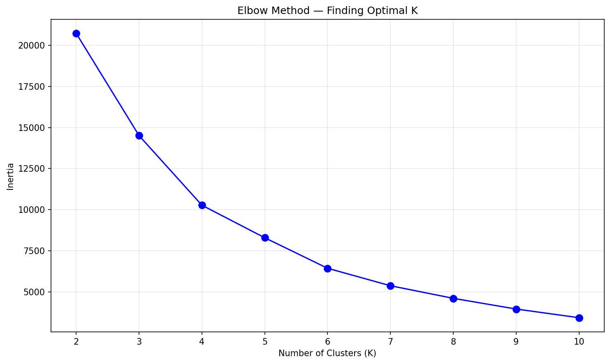
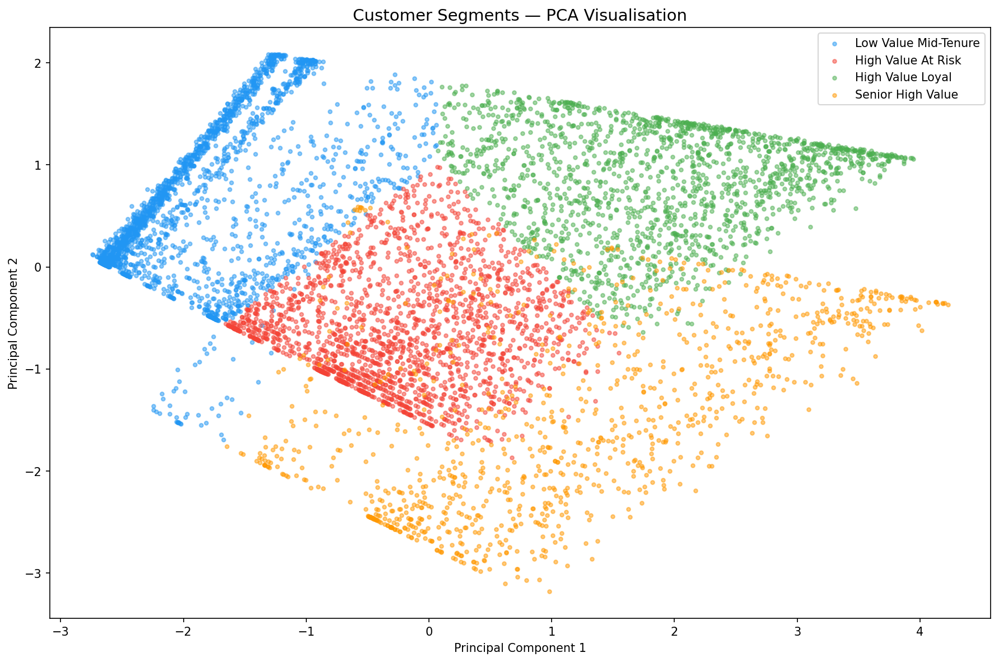
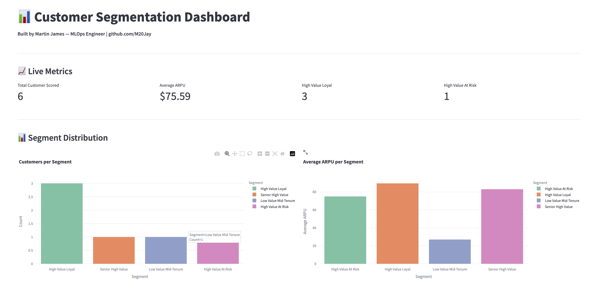
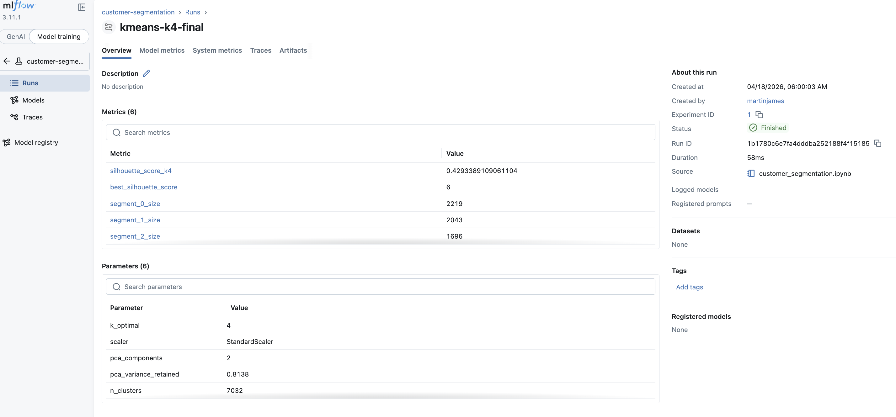
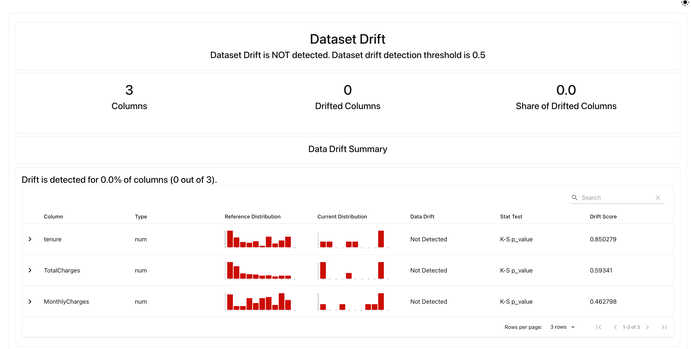

# Customer Segmentation Pipeline
**Author:** Martin James Ng'ang'a | [github.com/M20Jay](https://github.com/M20Jay)  
**Status:** ✅ Complete — Week 3 of 15  
**Stack:** KMeans · PCA · StandardScaler · MLflow · Evidently · Streamlit · FastAPI · PostgreSQL · Docker · Prometheus · Render · AWS (pending)

---

## Business Problem

Most businesses treat all customers the same — sending identical campaigns to high value loyal customers and dormant low value ones alike. The result is wasted marketing budget, wrong conversations, and missed revenue opportunities.

This pipeline uses unsupervised machine learning to identify 4 distinct customer groups from behavioural data — enabling targeted, data-driven intervention for each segment.

---

## The 4 Segments

| Segment | Customers | Avg ARPU | Churn Rate | Action |
|---------|-----------|----------|------------|--------|
| 🏆 High Value Loyal | 1,696 | $89.77 | 24.29% | Reward and retain |
| ⚠️ High Value At Risk | 2,043 | $75.28 | 28.29% | Intervene immediately |
| 📈 Low Value Mid-Tenure | 2,219 | $27.12 | 26.86% | Upsell opportunity |
| 👴 Senior High Value | 1,074 | $83.27 | 25.98% | Senior-specific offers |

---

## Live API

**Base URL:** `https://customer-segmentation-api-rwmx.onrender.com`  
**Interactive Docs:** `https://customer-segmentation-api-rwmx.onrender.com/docs`

> **Deployment note:** The API is currently hosted on Render's free tier which supports a single container only. This means the full production stack — PostgreSQL persistence, Prometheus monitoring, and Grafana dashboards — is not available on Render. Render's free tier does not support multi-container orchestration or persistent storage at scale. AWS EC2 deployment, which runs the complete docker-compose stack with all services, is pending AWS account activation and will replace Render as the primary production environment.

### Health Check
```bash
curl https://customer-segmentation-api-rwmx.onrender.com/health
```

### Predict Segment
```bash
curl -X POST "https://customer-segmentation-api-rwmx.onrender.com/segment" \
-H "Content-Type: application/json" \
-d '{
  "tenure": 34,
  "monthly_charges": 56.95,
  "total_charges": 1889.50,
  "arpu": 55.57,
  "senior_citizen": 0
}'
```

### Example Response
```json
{
  "segment": 1,
  "segment_name": "High Value At Risk",
  "recommended_action": "Immediate retention call",
  "input": {
    "tenure": 34.0,
    "monthly_charges": 56.95,
    "arpu": 55.57
  }
}
```

---

## Tech Stack

| Tool | Purpose |
|------|---------|
| KMeans | Customer clustering — 4 behavioural segments |
| PCA | Dimensionality reduction for visualisation |
| StandardScaler | Feature scaling before clustering |
| MLflow | Experiment tracking — comparing K values |
| Evidently | Data drift monitoring |
| Streamlit | Interactive business dashboard |
| FastAPI | REST API for live inference |
| PostgreSQL | Storing segment predictions |
| Docker | Containerisation |
| Prometheus | API metrics collection |
| Render | Current deployment — free tier, single container |
| AWS EC2 | Target production deployment — full stack |

---

## Dataset

IBM Telco Customer Churn Dataset — 7,032 customers · 21 features · Behavioural and demographic data.

---

## ML Methodology

The optimal number of clusters (K=4) was determined using two complementary methods. The elbow method identified where adding more clusters stopped yielding significant improvement in inertia. The silhouette score confirmed cluster quality, scoring 0.4293 at K=4. Although K=6 scored marginally higher mathematically (0.4555), K=4 was chosen because four segments map cleanly to actionable business language — a principle of interpretability over marginal metric gain.

---

## Screenshots

### Elbow Method


### PCA Cluster Visualisation


### Streamlit Dashboard


### MLflow Experiment Tracking


### Evidently Data Drift Report


---

## How to Run Locally

```bash
# Clone the repo
git clone https://github.com/M20Jay/customer-segmentation.git
cd customer-segmentation

# Start all containers
docker compose up -d

# Run Streamlit dashboard
streamlit run streamlit_app.py

# Generate drift report
python evidently_report.py
```

---

## Progress

| Component | Status |
|-----------|--------|
| EDA + Feature Engineering | ✅ Complete |
| StandardScaler + PCA | ✅ Complete |
| Elbow Method + Silhouette | ✅ Complete |
| KMeans Training K=4 | ✅ Complete |
| Segment Profiling and Naming | ✅ Complete |
| MLflow Experiment Tracking | ✅ Complete |
| FastAPI /segment endpoint | ✅ Complete |
| PostgreSQL predictions storage | ✅ Complete |
| Docker containerisation | ✅ Complete |
| Streamlit dashboard | ✅ Complete |
| Evidently drift report | ✅ Complete |
| Render deployment | ✅ Live |
| AWS EC2 deployment | ⏳ Pending — AWS account activation |

---

*Part of a 15-week MLOps programme building production ML systems from scratch.*  
*Week 3 of 15 — Building in public. No shortcuts. 🇰🇪*